# Morgul Project Analysis

A comprehensive analysis of the Morgul processing toolset for Diamond Jungfrau detectors.

## Executive Summary

**Morgul** is a high-performance data processing pipeline for Jungfrau X-ray detectors at Diamond Light Source. The project contains two main components:

- **morgul-cuda**: The primary, modern CUDA-based live correction system (~3,254 lines of C++/CUDA)
- **morgul (Python)**: Legacy offline processing toolset for calibration, conversion, and visualization

---

## Project Structure Overview

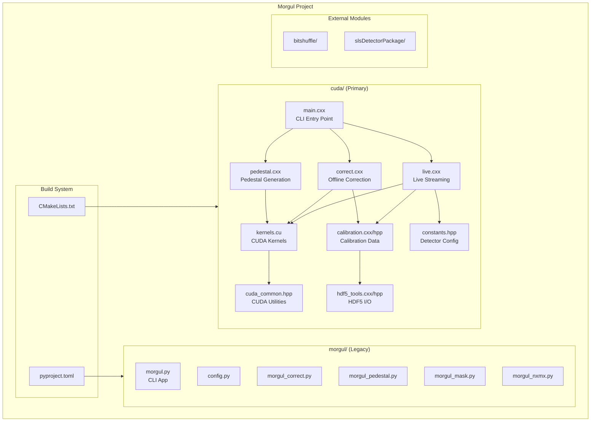

---

## CUDA Architecture (Primary Focus)

### File Organization

| File | Lines | Purpose |
|------|-------|---------|
| `main.cxx` | 138 | CLI argument parsing and command dispatch |
| `live.cxx` | 953 | Live streaming acquisition and processing |
| `correct.cxx` | 112 | Offline correction workflow |
| `pedestal.cxx` | 33 | Pedestal generation workflow |
| `kernels.cu` | 180 | CUDA computation kernels |
| `kernels.h` | 30 | Kernel declarations |
| `calibration.cxx` | 330 | Calibration data loading/GPU upload |
| `calibration.hpp` | 81 | Calibration data structures |
| `cuda_common.hpp` | 400 | CUDA memory management & utilities |
| `cuda_argparse.hpp` | ~100 | CUDA device selection |
| `hdf5_tools.cxx/hpp` | 281 | HDF5 I/O abstractions |
| `constants.hpp` | 150 | Detector configurations |
| `array2d.hpp` | 78 | 2D array container |
| `common.hpp` | 238 | General utilities |
| `commands.hpp` | 30 | Command argument structures |

### Command Flow

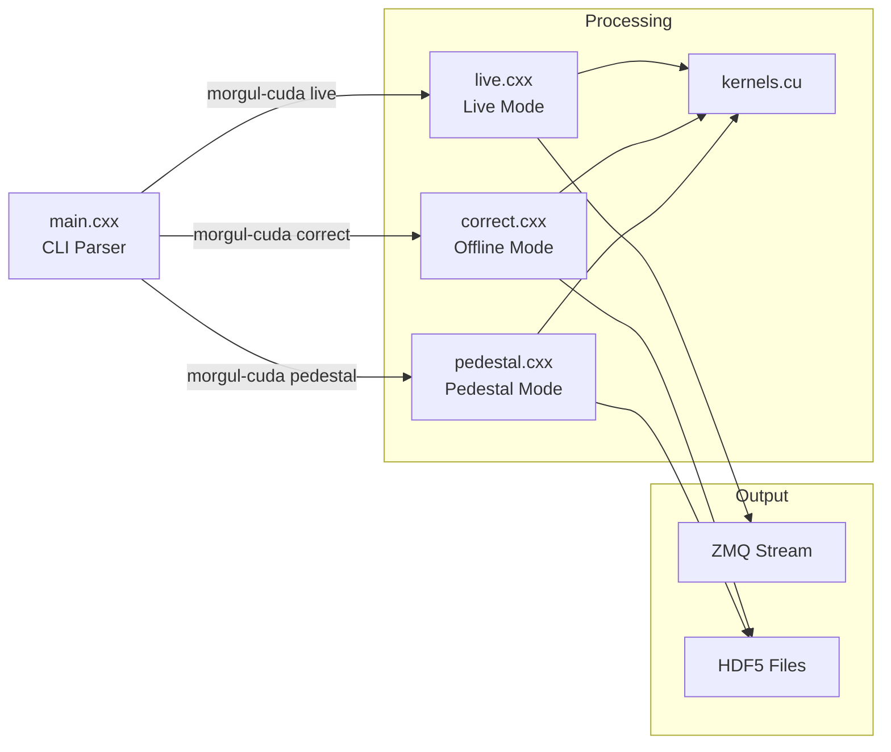

---

## Live Processing Pipeline

The live processing system (`live.cxx`) is the heart of morgul-cuda, handling real-time data from Jungfrau detectors.

### Live Data Flow

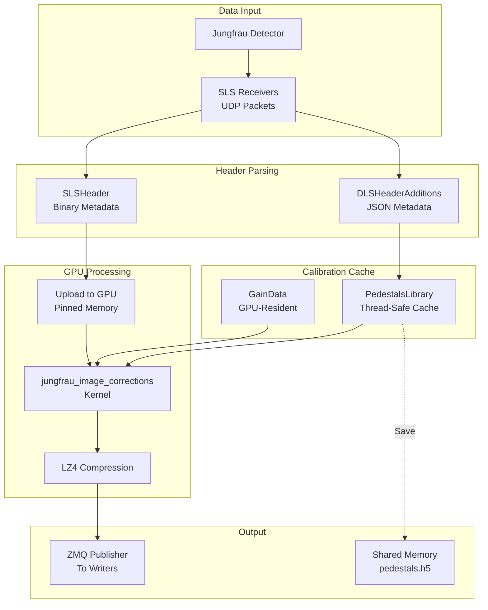

### Multi-Threaded Architecture

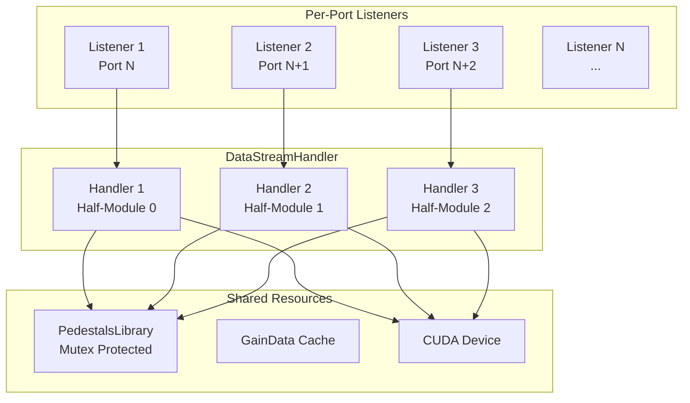

---

## CUDA Kernel Architecture

### Image Correction Kernel

The main processing kernel `jungfrau_image_corrections` performs per-pixel correction:

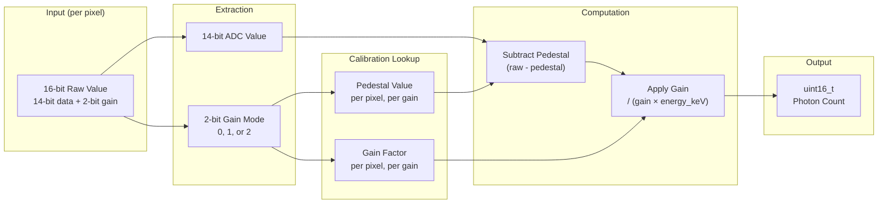

### Kernel Thread Organization

```
Grid:    (32, 8) blocks = 256 blocks total
Threads: (32, 32) per block = 1024 threads per block
Coverage: 1024 × 256 pixels (one half-module)
```

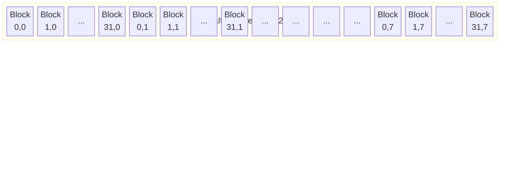

### Pedestal Accumulation Pipeline

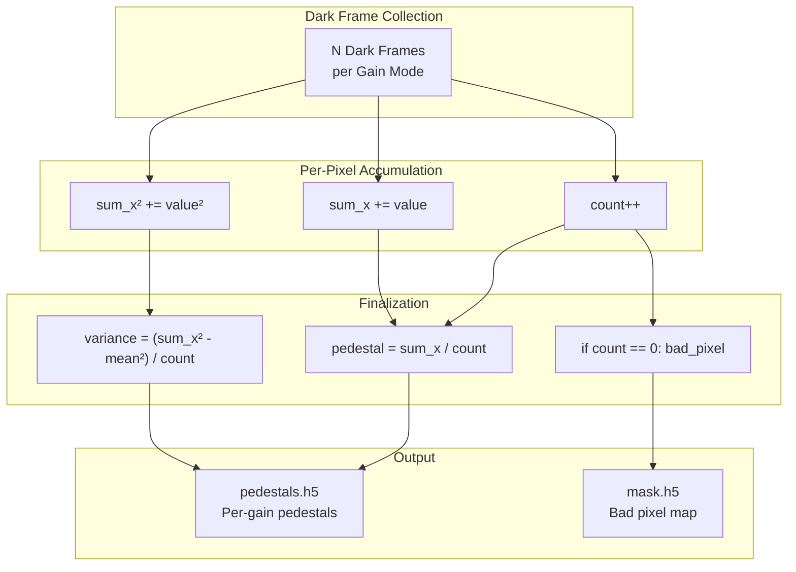

---

## Memory Management

### CUDA Smart Pointers

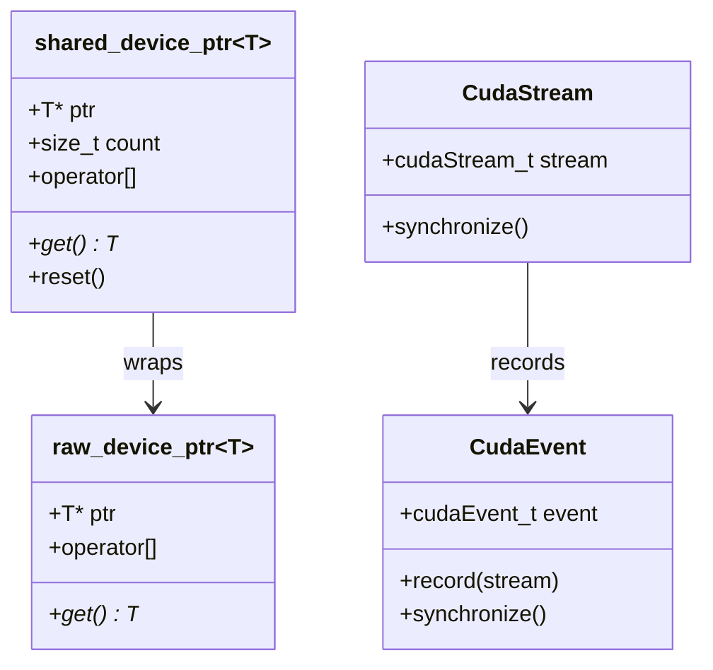

### Memory Allocation Helpers

| Function | Purpose |
|----------|---------|
| `make_cuda_malloc<T>(n)` | Allocate device memory |
| `make_cuda_pinned_malloc<T>(n)` | Allocate pinned host memory |
| `make_cuda_managed_malloc<T>(n)` | Allocate unified memory |
| `cuda_memcpy_htod()` | Host to device transfer |
| `cuda_memcpy_dtoh()` | Device to host transfer |

---

## Calibration Data Architecture

### CalibrationDataPath Structure

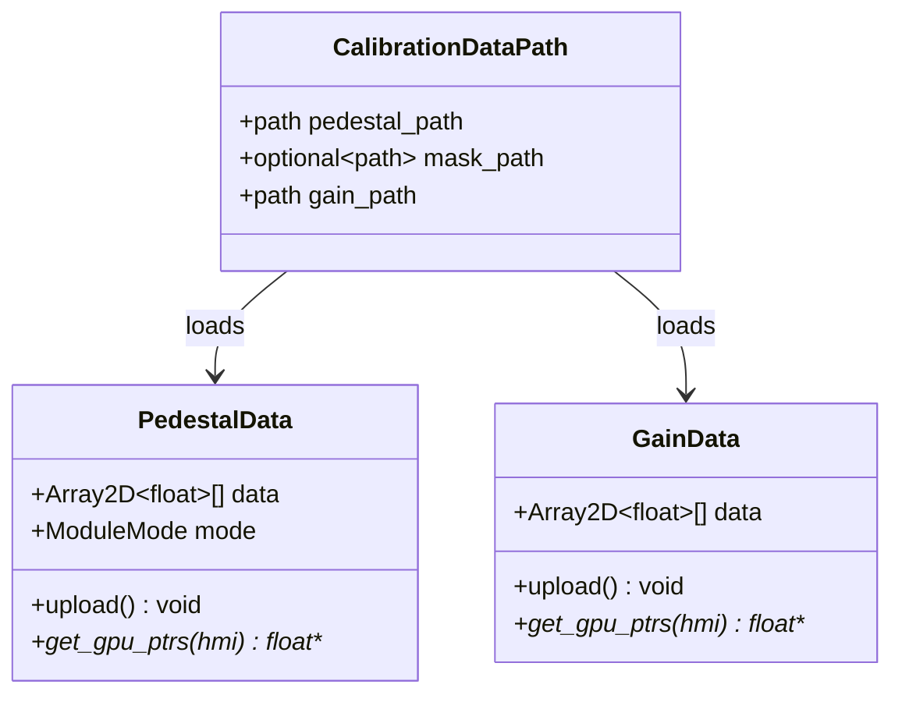

### Calibration Discovery

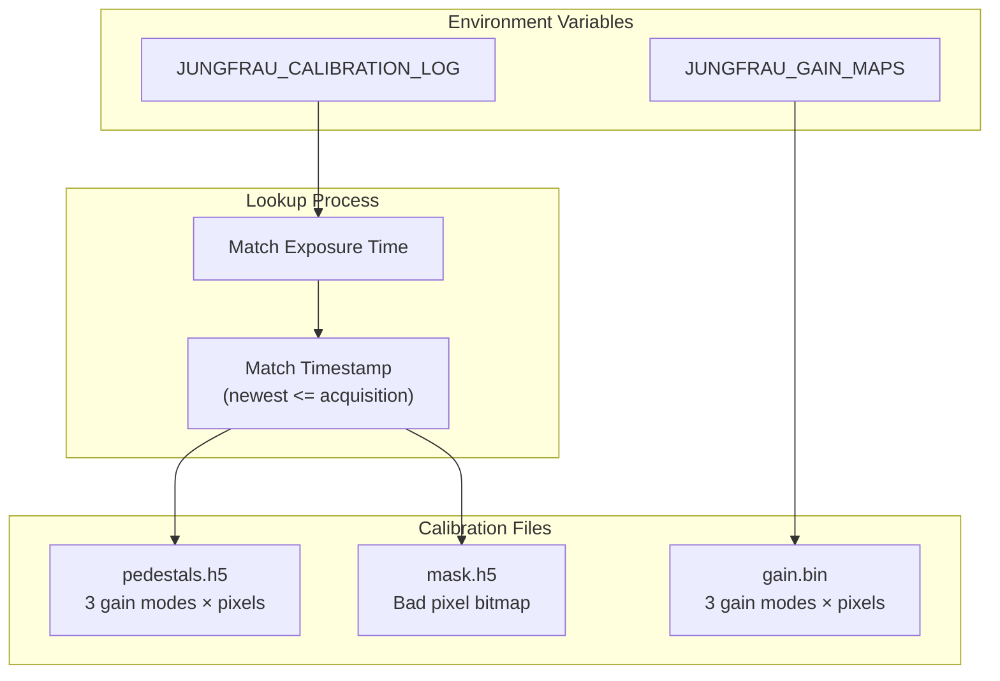

---

## Detector Configurations

### Supported Detectors

| Detector | Modules | Half-Modules | Total Pixels |
|----------|---------|--------------|--------------|
| JF1M | 2 | 4 | 2 × 1024 × 512 |
| JF9M | 18 | 36 | 18 × 1024 × 512 |
| JF9M-SIM | 18 | 36 | 18 × 1024 × 512 |

### Module Layout (JF9M)

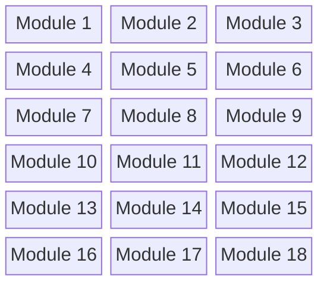

Each module consists of 2 half-modules (1024×256 each).

---

## Build System

### Dependencies

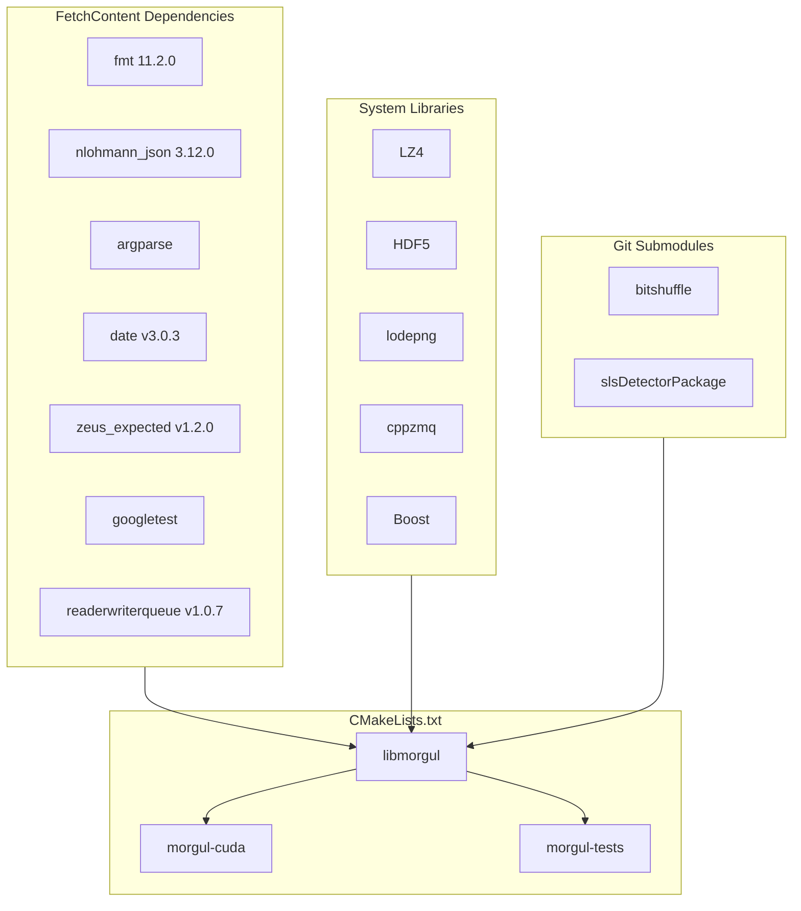

### Build Requirements

- CMake 3.24+
- CUDA 12.2+
- C++20 / CUDA C++20
- System packages: LZ4, HDF5, ZeroMQ, Boost

---

## Python Toolset (Legacy)

### Module Overview

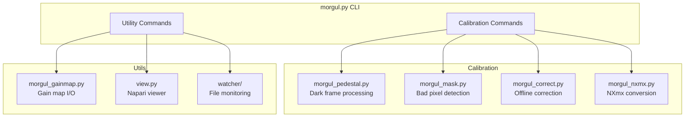

---

## Data Flow Summary

### End-to-End Processing

```mermaid
flowchart LR
    subgraph Acquisition["Data Acquisition"]
        XRAY[X-Ray Source]
        SAMPLE[Sample]
        DETECTOR[Jungfrau Detector]
    end

    subgraph Transport["Data Transport"]
        UDP[UDP Packets]
        SLS[SLS Receivers]
    end

    subgraph Processing["CUDA Processing"]
        PARSE[Parse Headers]
        UPLOAD[Upload to GPU]
        CORRECT[Apply Corrections]
        COMPRESS[LZ4 Compress]
    end

    subgraph Output["Data Output"]
        ZMQ[ZMQ Stream]
        WRITER[File Writers]
        HDF5[HDF5 Files]
    end

    XRAY --> SAMPLE --> DETECTOR
    DETECTOR --> UDP --> SLS
    SLS --> PARSE --> UPLOAD --> CORRECT --> COMPRESS
    COMPRESS --> ZMQ --> WRITER --> HDF5
```

---

## Key Design Patterns

1. **GPU-First Processing**: All heavy computation on CUDA; CPU handles I/O only
2. **Smart Memory Management**: `shared_device_ptr<T>` ensures CUDA memory safety
3. **Stream-Based Parallelism**: CUDA streams enable async operations
4. **Lock-Free Communication**: `moodycamel::ReaderWriterQueue` for threads
5. **Result-Type Error Handling**: `zeus::expected<T, E>` for explicit errors
6. **Hot-Swappable Calibration**: Pedestals updated on-the-fly during acquisition
7. **Multi-Detector Support**: Configuration-driven for JF1M, JF9M variants

---

## File Locations Reference

### Core CUDA Files
- `cuda/main.cxx` - CLI entry point
- `cuda/live.cxx` - Live streaming system
- `cuda/kernels.cu` - CUDA computation kernels
- `cuda/calibration.cxx` - Calibration data management
- `cuda/cuda_common.hpp` - Memory utilities

### Configuration
- `cuda/constants.hpp` - Detector specifications
- `CMakeLists.txt` - Build configuration
- `pyproject.toml` - Python dependencies

### Python Tools
- `morgul/morgul.py` - CLI application
- `morgul/config.py` - Configuration
- `morgul/morgul_correct.py` - Offline correction
